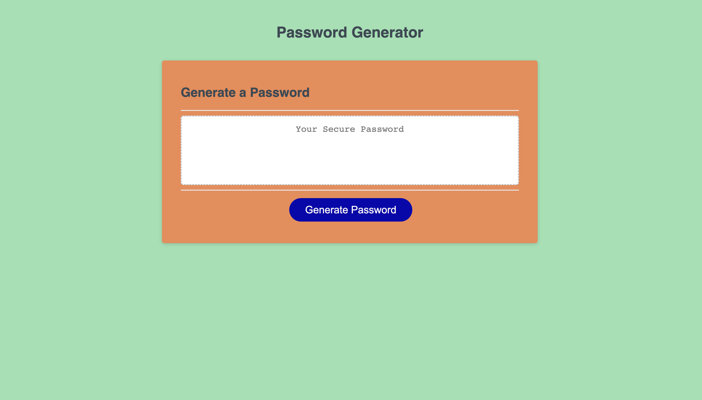
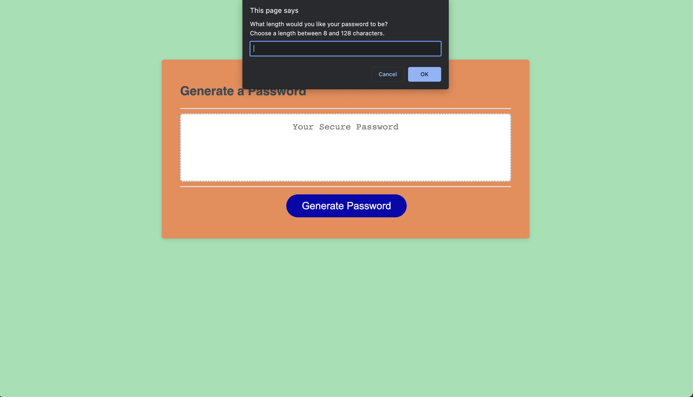
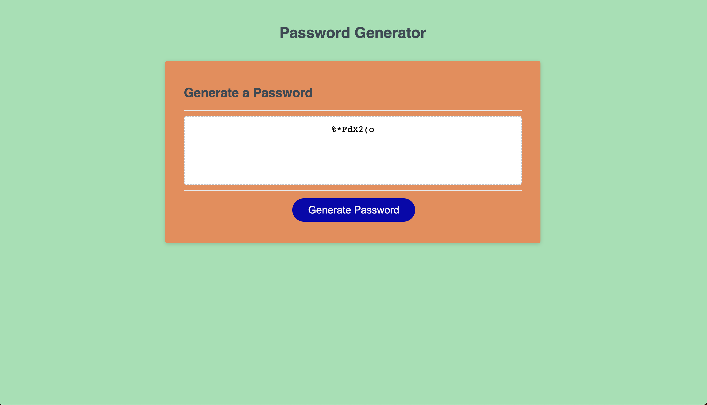

# <Generate Password>

## Description

I modified a starter code that enables the user to select the criteria to generate a random password.  The app runs in the browser and features starter code HTML and CSS and is powered by JavaScript that I wrote.  It is has a clean and polished look and adapts to multiple screen sizes.

## Usage

When the generate password button is clicked, a set of prompts allows the user to set the number of characters, between 8 and 128, for their password.  Then they are able to confirm the use of special characters, uppercase, lowercase, and numbers in their password.  Once the critera has been chosen by the user, at least one character type per selection of characters will be used in the generation of the random password.  The password will be then be written to the page in the Password Generator Box.

 

 
## Credits
 
Thank you to the Learning Assistants at AskBCS for helping me get started and for guiding me in the right direction when stuck.  Thank you to William Tikhonenko for sending me videos and notes on how to get started writing the code.  Thank you to Alexis Vasquez for sharing with me snippets of your code to compare with my code.  Thank you to Gerard Mennella for helping me with lines 37-39 and lines 66-81.  Gerard helped me to figure out how to write the password to the page and solve the issue of setting an empty array for the password.  

## Features

The page is nicely colored and allows you to generate as many passwords as needed consecutively and with many options for criteria.  

